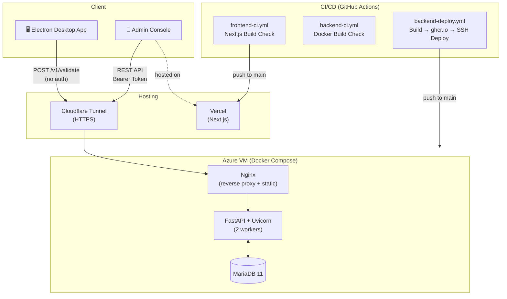

# LicenseOS

**License issuance and validation system for desktop applications**
**데스크톱 애플리케이션을 위한 라이선스 발급 및 검증 시스템**


---

## 🗂️ Overview / 개요

LicenseOS is a full-stack license management platform designed for software vendors who distribute Electron-based desktop applications. It provides a secure admin console for issuing license keys and a public validation API that desktop apps call at startup.

소프트웨어 배포사를 위한 라이선스 관리 플랫폼입니다. 어드민 콘솔을 통해 라이선스를 발급하고, 데스크톱 앱 시작 시 호출하는 공개 검증 API를 제공합니다.

---

## ✨ Key Features / 주요 기능

- **Multi-program management** — Manage licenses for multiple software products from a single dashboard
- **HWID-based device fingerprinting** — Limit activations per license by hardware ID; auto-register new devices up to the allowed count
- **Flexible meta variables** — Define per-program custom variable schemas (e.g. `max_collection_count`, `feature_x_enabled`) injected into validation responses
- **Dual Token authentication** — Access Token + Refresh Token with automatic rotation; Refresh Token stored in `httpOnly` cookie
- **Contact info on licenses** — Optional `user_id`, `email`, `phone` fields for post-sale support
- **Always-200 validation protocol** — Validation endpoint always returns HTTP 200; errors are conveyed via `valid: false` + `error_code` to prevent desktop apps from crashing on unexpected status codes

---

## 🛠️ Tech Stack / 기술 스택

### Backend
| | |
|---|---|
| Runtime | Python 3.13 |
| Framework | FastAPI |
| ORM | SQLAlchemy 2.x (`Mapped`, `mapped_column`) |
| Database | MariaDB 11 |
| Auth | JWT (PyJWT) + bcrypt + Refresh Token Rotation |
| Container | Docker (multi-stage build) |

### Frontend
| | |
|---|---|
| Framework | Next.js 16 (App Router) |
| Language | TypeScript |
| UI | Ant Design 6 + Tailwind CSS 4 |
| Hosting | Vercel |

### Infrastructure
| | |
|---|---|
| VPS | Azure VM (Docker Compose) |
| Tunnel | Cloudflare Tunnel (zero-config HTTPS) |
| Registry | GitHub Container Registry (ghcr.io) |
| CI/CD | GitHub Actions (path-based monorepo filtering) |

---

## 🏗️ Architecture / 아키텍처



---

## 📖 API Documentation / API 문서

FastAPI의 자동 생성 Swagger UI를 통해 모든 엔드포인트를 브라우저에서 직접 확인하고 테스트할 수 있습니다.

Interactive API docs are auto-generated via FastAPI's built-in Swagger UI with full request/response schemas and inline descriptions.

```
http://localhost:8001/docs     # Swagger UI
http://localhost:8001/redoc    # ReDoc
```

### Endpoint Summary

| Method | Endpoint | Auth | Description |
|--------|----------|------|-------------|
| `POST` | `/auth/login` | — | Admin login, issues Access + Refresh Token |
| `POST` | `/auth/refresh` | Cookie | Rotate Refresh Token, issue new Access Token |
| `POST` | `/auth/logout` | Cookie | Invalidate Refresh Token |
| `GET` | `/programs` | Bearer | List all programs |
| `POST` | `/programs` | Bearer | Create program with custom meta schema |
| `PATCH` | `/programs/{id}` | Bearer | Update program |
| `DELETE` | `/programs/{id}` | Bearer | Delete program |
| `GET` | `/programs/{id}/licenses` | Bearer | List licenses for a program |
| `POST` | `/programs/{id}/licenses` | Bearer | Issue new license key |
| `PATCH` | `/licenses/{id}` | Bearer | Update license |
| `DELETE` | `/licenses/{id}` | Bearer | Revoke license |
| `POST` | `/v1/validate` | — | **License validation (called by desktop app at startup)** |

### Validation API Design

The validate endpoint (`POST /v1/validate`) is the core public-facing API.
It always returns **HTTP 200** to prevent desktop app crashes, communicating errors via structured body:

```json
// Valid license
{
  "valid": true,
  "username": "홍길동",
  "expires_at": "2026-12-31T00:00:00",
  "meta": {
    "max_collection_count": 100,
    "feature_x_enabled": true
  }
}

// Invalid license
{
  "valid": false,
  "error_code": "device_limit_reached"
}
```

**Validation steps (in order):**
1. Verify `program_name` exists
2. Look up `license_key`
3. Confirm the license belongs to the requested program
4. Check `is_active` flag
5. Check `expires_at` against current UTC time
6. Check `hwid` — update `last_seen_at` if registered, auto-register if under `max_devices`, reject if at limit
7. Type-cast program meta variables and include in response

**Error codes:**
| Code | Reason |
|------|--------|
| `program_not_found` | Unknown program name |
| `license_not_found` | Invalid license key |
| `program_mismatch` | License belongs to a different program |
| `license_inactive` | License has been deactivated by admin |
| `license_expired` | License past its expiry date |
| `device_limit_reached` | All allowed device slots are occupied |

---

## 🚀 CI/CD Pipeline / CI/CD 파이프라인

Path-based filtering in GitHub Actions ensures only relevant workflows run, avoiding wasted CI minutes in a monorepo.

변경된 파일 경로를 감지해 필요한 워크플로우만 실행합니다.

| Workflow | Trigger | Action |
|----------|---------|--------|
| `frontend-ci.yml` | `frontend/**` push/PR on any branch | `npm run build` — catch build errors early |
| `backend-ci.yml` | `backend/**` push/PR on any branch | Docker build (no push) — catch Dockerfile/dependency errors |
| `backend-deploy.yml` | `backend/**` push to `main` only | Build → push to ghcr.io → SSH into VPS → `docker compose pull & up` |

Frontend deployment is handled automatically by **Vercel** on every push to `main`.

---

## 💻 Local Development / 로컬 개발 환경

### Prerequisites
- Docker
- Python 3.13
- Node.js 20

### Setup

```bash
# 1. Clone
git clone https://github.com/YOUR_USERNAME/license-system.git
cd license-system

# 2. Start DB
docker compose -f docker-compose.dev.yml up -d

# 3. Backend
cd backend
python -m venv venv
source venv/bin/activate        # Windows: venv\Scripts\activate
pip install -r requirements.txt
cp .env.example .env
uvicorn app.main:app --host 0.0.0.0 --port 8001 --reload

# 4. Frontend (new terminal)
cd frontend
npm install
# Create frontend/.env.local with: NEXT_PUBLIC_API_URL=http://localhost:8001
npm run dev
```

| Service | URL |
|---------|-----|
| Frontend | http://localhost:3000 |
| Backend API | http://localhost:8001 |
| Swagger UI | http://localhost:8001/docs |

---

## 🔑 Environment Variables / 환경변수

환경변수 전체 목록과 설명은 [`.env.example`](.env.example)을 참고하세요.
See [`.env.example`](.env.example) for the full list of required environment variables.

> ⚠️ **Never commit secrets to git.** Production secrets are managed via VPS `.env` file and Vercel project settings.

---

## 🔧 Troubleshooting / 트러블슈팅

| Symptom | Cause | Fix |
|---------|-------|-----|
| `Unknown column 'xxx'` | Column added to model but not in existing table | Run `ALTER TABLE` manually (project uses `create_all`, not Alembic) |
| `Connection refused` on port 8001 | uvicorn not running | `cd backend && uvicorn app.main:app --port 8001 --reload` |
| `Connection refused` on port 3307 | DB container not running | `docker compose -f docker-compose.dev.yml up -d` |
| CORS error in browser | Frontend origin not in allow list | Check `allow_origins` in `backend/app/main.py` |
| Frontend API calls failing | Wrong `NEXT_PUBLIC_API_URL` | Check `frontend/.env.local` |
| Login session lost on refresh | `httpOnly` cookie not persisting | Ensure `allow_credentials=True` and correct `allow_origins` (not wildcard) |
| `device_limit_reached` on validate | All device slots in use | Admin console → revoke a device, or increase `max_devices` |
| Docker CI build fails | Dependency or syntax error in Dockerfile | Run `docker build ./backend` locally to reproduce |

> 📄 For detailed developer workflows including DB schema migration, see [DEV.md](DEV.md).

---

## 💡 개발 노트 / 설계 고찰

실제 개발 과정에서 마주쳤던 문제들과 그에 대한 판단을 기록합니다.

### 1. Refresh Token을 DB에 해시로 저장한 이유

처음에는 Refresh Token을 평문으로 DB에 저장했는데, 이 방식은 DB가 유출됐을 때 모든 세션이 탈취될 수 있다는 문제가 있었습니다. Access Token은 짧은 만료 시간(30분)으로 피해 범위를 제한할 수 있지만, Refresh Token은 7일짜리라 유출 시 영향이 컸습니다.

`hashlib.sha256`으로 해싱한 뒤 저장하도록 변경했고, 검증 시에도 요청으로 받은 토큰을 동일하게 해싱해서 비교하는 방식으로 처리했습니다. 비밀번호 해싱처럼 bcrypt를 쓰지 않은 이유는, Refresh Token은 이미 충분한 엔트로피를 가진 랜덤 값(`secrets.token_urlsafe(32)`)이라 salt 없이 SHA-256만으로도 실질적인 보안 수준이 유지되기 때문입니다.

### 2. 라이선스 검증 API가 항상 HTTP 200을 반환하도록 설계한 이유

초기 설계에서는 유효하지 않은 라이선스에 대해 HTTP 403을 반환했는데, 이 방식은 데스크톱 앱 클라이언트 입장에서 예외 처리가 복잡해지는 문제가 있었습니다. 특히 네트워크 오류(timeout, 503 등)와 라이선스 오류를 구분해서 처리해야 할 때 클라이언트 코드가 지저분해졌습니다.

항상 HTTP 200을 반환하되 `valid: false` + `error_code`로 이유를 전달하는 방식으로 바꿨습니다. 클라이언트는 네트워크 예외와 비즈니스 로직 오류를 분리해서 처리할 수 있게 됐고, 코드도 단순해졌습니다. 단, 이 엔드포인트가 공개 API이므로 응답 본문에 내부 구현 정보가 노출되지 않도록 `error_code`는 사전에 정의된 값만 반환하도록 제한했습니다.

### 3. `exclude_none` → `exclude_unset` 변경으로 null 값 명시 처리

라이선스의 선택 필드(email, phone 등)를 수정하는 PATCH API에서 `model_dump(exclude_none=True)`를 사용했더니, 이미 입력된 값을 의도적으로 지우려고 `null`을 보내도 업데이트 딕셔너리에서 제외되어 기존 값이 그대로 유지되는 문제가 발생했습니다.

`exclude_unset=True`로 변경하면 클라이언트가 명시적으로 전달한 필드만 업데이트 대상에 포함됩니다. `null`을 보내면 해당 필드를 `null`로 덮어쓰고, 아예 보내지 않으면 기존 값이 유지됩니다. PATCH 시맨틱에 더 부합하는 방식이라 판단했습니다.

### 4. 모노레포 CI에서 path filtering의 한계

GitHub Actions의 `paths` 필터로 프론트엔드/백엔드 변경을 각각 감지하도록 설정했는데, Branch Protection Rules에서 두 체크를 모두 Required로 설정하면 문제가 생겼습니다. 프론트엔드만 수정한 PR에서는 백엔드 CI가 아예 실행되지 않아 `Docker Build Check`가 "Waiting for status" 상태로 계속 남아 머지 자체가 불가능해졌습니다.

결론적으로 Required 체크는 항상 실행되는 것만 지정해야 한다는 점을 확인했습니다. 현재는 Vercel 배포 체크만 Required로 두고, GitHub Actions CI는 PR 페이지에서 결과를 확인한 후 직접 판단해서 머지하는 방식으로 운영합니다.

### 5. Cloudflare Pages → Vercel 마이그레이션

초기에 프론트엔드 배포를 Cloudflare Pages로 설정했으나 배포 후 404가 발생했습니다. 원인은 이 프로젝트가 SSR 모드(`output: 'export'` 없음)인데, Cloudflare Pages는 Next.js SSR을 기본 지원하지 않고 `@cloudflare/next-on-pages` 추가 설정이 필요하기 때문이었습니다.

특히 `/admin/programs/[id]` 같은 동적 라우트는 DB에서 런타임에 ID를 가져오는 구조라 Static Export로 전환하는 것도 불가능했습니다. Vercel은 Next.js를 만든 팀이 운영하는 플랫폼이라 추가 설정 없이 즉시 동작했고, GitHub 연동 자동 배포도 동일하게 지원해 마이그레이션 비용이 거의 없었습니다.
