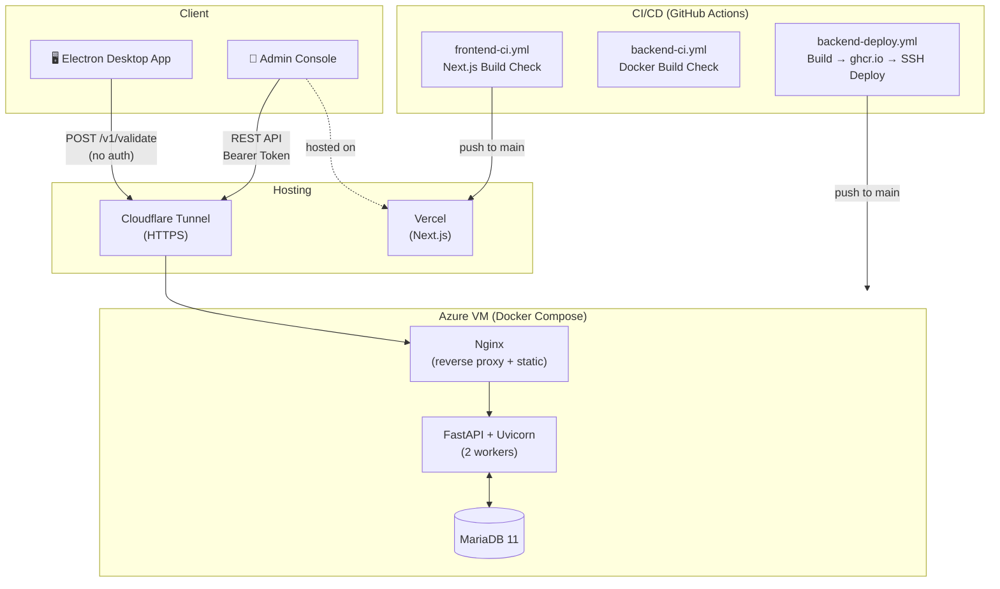

# LicenseOS

**데스크톱 애플리케이션을 위한 라이선스 발급 및 검증 시스템**
*License issuance and validation system for desktop applications*


---

## 🎯 Problem / 문제인식

Electron 데스크톱 앱을 배포하는 벤더로서, 초기에는 **Cloudflare KV**에 `{id, secretKey, expiry}` 형태로 사용자를 하나씩 넣어 라이선스를 검증했습니다. 사용자가 **50명을 넘어가면서** 단일 JSON을 손으로 관리하는 방식이 한계에 부딪혔습니다. flat key-value 구조라서 ― (1) **프로그램(제품) 구분이 없어** 한 사용자가 여러 제품을 쓰면 관리할 수 없고, (2) **키당 기기 수 제한**이 불가능하며(HWID 개념 부재), (3) **제품별 메타데이터**를 검증 응답에 실을 수 없고, (4) `expiry`가 raw timestamp라 발급할 때마다 **수기 계산**이 필요했습니다. 게다가 검증 API는 앱 시작 시 호출되므로 **무인증 공개**여야 하고, 그 자체가 가장 큰 공격 표면이었습니다.

As a vendor shipping Electron desktop apps, I initially validated licenses by hand-entering users as `{id, secretKey, expiry}` into **Cloudflare KV**. Past **50+ users**, managing a single JSON by hand hit a wall: a flat key-value store meant (1) no notion of a *program/product*, so one user across multiple products was unmanageable, (2) no per-key device limits (no HWID), (3) no per-product metadata in the validation response, and (4) `expiry` as a raw timestamp forced manual date math on every issue. On top of that, the validation API is called at app startup, so it must be **public (no auth)** — the single largest attack surface.

---

## 💡 Approach / 접근·의사결정

KV의 flat 구조로는 위 네 가지를 근본적으로 풀 수 없다고 판단해, **프로그램(제품) → 라이선스 → 기기**의 3계층 관계형 모델로 **전면 재설계했습니다.**

- **프로그램 단위 키 관리** — 제품별로 라이선스를 발급·격리합니다 (`models/program.py`, `license.py`)
- **키당 기기 제한** — HWID 지문으로 활성 기기를 등록·제한하고, 한도 내에서 자동 등록합니다 (`domain/device_activation.py`)
- **프로그램별 메타 스키마** — 제품마다 커스텀 변수를 정의해 검증 응답에 주입합니다 (`domain/program_meta.py`)
- **무손실 이관** — 기존 KV 데이터를 버리지 않고, legacy JSON을 **행 단위 성공/실패 리포트**로 검증하며 새 스키마로 이관합니다 (`app/admin/migrate`)
- **데이터 밀도 높은 어드민 UI** — 대시보드·프로그램 워크스페이스의 상태·파생 로직을 `lib` 레이어로 분리해 관리합니다 (React · Next.js · TypeScript · Ant Design)
- **공개 엔드포인트 방어** — 검증 API를 always-200으로 설계하고, error_code 축소·다차원 rate limit·nginx 하드닝으로 공격 표면을 좁혔습니다

이 저장소의 대표 테마는 **보안·운영 신뢰성**입니다. 빠르게 훑고 싶다면 대표 의사결정 2개부터 보세요: [always-200 검증 API 설계](#2-라이선스-검증-api가-항상-http-200을-반환하도록-설계한-이유) · [Cloudflare Tunnel 중복 커넥터 502](#6-cloudflare-tunnel-커넥터-중복으로-인한-502).

Judging that a flat KV store could never solve those four issues, I **redesigned** the system around a three-tier relational model: **Program (product) → License → Device**. Program-scoped keys, HWID-based per-key device limits, per-program meta schemas injected into the validation response, and a lossless migration path from legacy KV JSON (imported with a row-by-row success/failure report). The public validation endpoint is hardened with an always-200 protocol, reduced error codes, multi-dimensional rate limits, and nginx-level controls. The flagship theme of this repo is **security & operational reliability**.

> 🤖 이 저장소는 `AGENTS.md` / `CLAUDE.md`로 AI 코딩 에이전트(Claude Code · Codex) 협업 규칙을 명시하고, 아키텍처·보안 결정과 검증은 직접 주도했습니다.

---

## 🗂️ Overview / 개요

Electron 기반 데스크톱 앱을 배포하는 소프트웨어 벤더를 위한 풀스택 라이선스 관리 플랫폼입니다. 라이선스 키를 발급하는 보안 어드민 콘솔과, 데스크톱 앱이 시작 시 호출하는 공개 검증 API를 제공합니다.

*A full-stack license management platform for software vendors distributing Electron-based desktop apps — a secure admin console for issuing keys and a public validation API called at app startup.*

---

## ✨ Key Features / 주요 기능

| 기능 | 설명 | Description (EN) |
|---|---|---|
| **다중 프로그램 관리** | 여러 소프트웨어 제품의 라이선스를 단일 대시보드에서 관리 | Manage licenses for multiple products from one dashboard |
| **HWID 기기 지문** | 하드웨어 ID로 라이선스당 활성화를 제한하고, 허용 수량까지 신규 기기를 자동 등록 | Per-license activation limits by HWID with auto-registration |
| **유연한 메타 변수** | 프로그램별 커스텀 변수 스키마(`max_collection_count` 등)를 검증 응답에 주입 | Per-program custom variable schemas injected into responses |
| **이중 토큰 인증** | Access + Refresh Token 자동 로테이션, Refresh Token은 `httpOnly` 쿠키에 저장 | Access + Refresh token rotation; refresh in `httpOnly` cookie |
| **라이선스 연락처** | 판매 후 지원을 위한 선택 필드(`user_id`·`email`·`phone`) | Optional contact fields for post-sale support |
| **Always-200 검증 프로토콜** | 항상 HTTP 200을 반환하고 오류는 `valid: false` + `error_code`로 전달해, 예기치 못한 상태 코드로 데스크톱 앱이 죽지 않게 함 | Always returns HTTP 200; errors via `valid:false` + `error_code` |
| **데이터 밀도 높은 어드민 콘솔** | 대시보드(활성/만료임박/최근접속)와 프로그램 워크스페이스, 파생 로직을 전역 스토어 대신 `lib` 레이어로 분리 | Data-dense console; derivation split into a `lib` layer |
| **레거시 KV 마이그레이션** | 레거시 Cloudflare KV JSON을 행 단위 성공/실패 리포트와 함께 새 스키마로 이관 | Import legacy KV JSON with per-row success/failure reporting |
| **GitHub Release 연결** | 각 프로그램 페이지에서 해당 제품의 GitHub Release로 바로 연결해 발급→배포 동선 일원화 | Link each program page to its GitHub Release page |

---

## 🛠️ Tech Stack / 기술 스택

### Backend
| | |
|---|---|
| Runtime | Python 3.13 |
| Framework | FastAPI |
| ORM | SQLAlchemy 2.x (`Mapped`, `mapped_column`) |
| Database | MariaDB 11 |
| Auth | JWT (PyJWT) + bcrypt + Refresh Token Rotation |
| Container | Docker (multi-stage build) |

### Frontend
| | |
|---|---|
| Framework | Next.js 16 (App Router) |
| Language | TypeScript |
| UI | Ant Design 6 + Tailwind CSS 4 |
| Hosting | Vercel |

### Infrastructure
| | |
|---|---|
| VPS | Azure VM (Docker Compose) |
| Tunnel | Cloudflare Tunnel (zero-config HTTPS) |
| Registry | GitHub Container Registry (ghcr.io) |
| CI/CD | GitHub Actions (path-based monorepo filtering) |

---

## 🏗️ Architecture / 아키텍처


```mermaid
graph TB
    subgraph Client["Client"]
        APP["🖥️ Electron Desktop App"]
        ADMIN["👤 Admin Console"]
    end

    subgraph Hosting["Hosting"]
        PAGES["Vercel\n(Next.js)"]
        TUNNEL["Cloudflare Tunnel\n(HTTPS)"]
    end

    subgraph VPS["Azure VM (Docker Compose)"]
        NGINX["Nginx<br/>(reverse proxy + static)"]
        API["FastAPI + Uvicorn<br/>(2 workers)"]
        DB[("MariaDB 11")]
    end

    subgraph CICD["CI/CD (GitHub Actions)"]
        CI_FE["frontend-ci.yml\nNext.js Build Check"]
        CI_BE["backend-ci.yml\nDocker Build Check"]
        CD_BE["backend-deploy.yml\nBuild → ghcr.io → SSH Deploy"]
    end

    APP -->|"POST /v1/validate\n(no auth)"| TUNNEL
    ADMIN -->|"REST API\nBearer Token"| TUNNEL
    TUNNEL --> NGINX
    NGINX --> API
    API <--> DB

    ADMIN -.->|hosted on| PAGES

    CI_FE -->|"push to main"| PAGES
    CD_BE -->|"push to main"| VPS
```

---

## 📖 API Documentation / API 문서

FastAPI의 자동 생성 Swagger UI를 통해 모든 엔드포인트를 브라우저에서 직접 확인하고 테스트할 수 있습니다.

*Interactive API docs are auto-generated via FastAPI's built-in Swagger UI with full request/response schemas and inline descriptions.*

```
http://localhost:8001/docs     # Swagger UI
http://localhost:8001/redoc    # ReDoc
```

### Endpoint Summary

| Method | Endpoint | Auth | Description |
|--------|----------|------|-------------|
| `POST` | `/auth/login` | — | Admin login, issues Access + Refresh Token |
| `POST` | `/auth/refresh` | Cookie | Rotate Refresh Token, issue new Access Token |
| `POST` | `/auth/logout` | Cookie | Invalidate Refresh Token |
| `GET` | `/programs` | Bearer | List all programs |
| `POST` | `/programs` | Bearer | Create program with custom meta schema |
| `PATCH` | `/programs/{id}` | Bearer | Update program |
| `DELETE` | `/programs/{id}` | Bearer | Delete program |
| `GET` | `/programs/{id}/licenses` | Bearer | List licenses for a program |
| `POST` | `/programs/{id}/licenses` | Bearer | Issue new license key |
| `PATCH` | `/licenses/{id}` | Bearer | Update license |
| `DELETE` | `/licenses/{id}` | Bearer | Revoke license |
| `POST` | `/v1/validate` | — | **License validation (called by desktop app at startup)** |

### Validation API Design

검증 엔드포인트(`POST /v1/validate`)는 이 시스템의 핵심 공개 API입니다. 데스크톱 앱의 크래시를 막기 위해 **항상 HTTP 200**을 반환하고, 오류는 구조화된 응답 본문으로 전달합니다.

*The validate endpoint is the core public-facing API. It always returns **HTTP 200** to prevent desktop-app crashes, conveying errors via a structured body:*

```json
// Valid license
{
  "valid": true,
  "username": "홍길동",
  "expires_at": "2026-12-31T00:00:00",
  "meta": {
    "max_collection_count": 100,
    "feature_x_enabled": true
  }
}

// Invalid license
{
  "valid": false,
  "error_code": "device_limit_reached"
}
```

**Validation steps (in order):**
1. Verify `program_name` exists
2. Look up `license_key`
3. Confirm the license belongs to the requested program
4. Check `is_active` flag
5. Check `expires_at` against current UTC time
6. Check `hwid` — update `last_seen_at` if registered, auto-register if under `max_devices`, reject if at limit
7. Type-cast program meta variables and include in response

**Error codes:**
| Code | Reason |
|------|--------|
| `invalid_license` | Program name / license key combination is not valid |
| `license_unusable` | License exists but cannot be used right now |
| `device_limit_reached` | All allowed device slots are occupied |
| `rate_limited` | Validation requests are temporarily throttled |

---

## 🔐 Security Hardening / 보안 강화

최근 운영 중인 서비스의 공격 표면을 줄이기 위해, 인증/검증/에러 노출 영역을 중심으로 몇 가지 보안 하드닝을 적용했습니다.

### 1. Admin login brute-force 대응

- `POST /auth/login`에 경량 in-memory rate limit을 추가했습니다.
- 현재는 단일 VM 환경을 고려해 Redis 없이 동작하며, 다음 세 가지 기준을 함께 봅니다.
  - IP 기준: `20회 / 5분`
  - username 기준: `10회 / 10분`
  - IP+username 기준: `8회 / 10분`
- 목적은 무차별 대입(brute force)과 credential stuffing의 성공 확률을 낮추는 것입니다.

### 2. Public validate abuse control

- `POST /v1/validate`는 Electron 앱 시작 시 호출되는 공개 엔드포인트이므로, 인증 없이 접근 가능하다는 점이 가장 큰 abuse surface였습니다.
- 여기에 다음 기준의 abuse control을 추가했습니다.
  - IP 기준: `120회 / 1분`
  - license key 기준: `30회 / 1분`
  - IP+license key 기준: `20회 / 1분`
- 정상 사용자를 불필요하게 막지 않도록 **성공 요청은 예산을 소모하지 않고**, 유효하지 않은 검증 요청만 카운트합니다.

### 3. Validate error code 축소

- 원래 validate API는 `program_not_found`, `license_not_found`, `program_mismatch`, `license_inactive`, `license_expired`처럼 내부 상태를 비교적 자세히 드러냈습니다.
- 이 구조는 라이선스 존재 여부나 프로그램 매칭 상태를 추측하는 데 도움을 줄 수 있어, 외부 공개 error code를 다음처럼 축소했습니다.
  - `invalid_license`
  - `license_unusable`
  - `device_limit_reached`
  - `rate_limited`
- 응답 스키마(`valid`, `error_code`, `username`, `expires_at`, `meta`)는 유지하면서, 상태 노출만 줄이는 방향을 택했습니다.

### 4. Bulk import 내부 예외 메시지 노출 제거

- 기존 `bulk_import()`는 예외 발생 시 `error=str(e)`를 그대로 응답에 포함하고 있었습니다.
- 이 방식은 DB 제약조건명, 내부 컬럼 정보, ORM 예외 메시지 같은 구현 세부사항이 어드민 UI까지 그대로 노출될 수 있다는 문제가 있었습니다.
- 현재는 예외 유형별로 사용자에게 안전한 메시지만 반환하고, 내부 예외 문자열은 직접 노출하지 않도록 수정했습니다.

### 5. Nginx 프록시 레이어 하드닝

- 앱 레벨 방어만으로는 부족할 수 있어, `nginx/nginx.conf`에도 프록시 레벨 보안 설정을 추가했습니다.
- 주요 변경 사항은 다음과 같습니다.
  - `/auth/login`, `/v1/validate`에 대한 IP 기준 rate limit
  - `client_max_body_size`, `client_body_timeout`, `client_header_timeout` 제한
  - `keepalive_timeout`, `proxy_*_timeout` 축소
  - `server_tokens off`, `Referrer-Policy`, `Content-Security-Policy`, `X-Content-Type-Options` 적용
  - Cloudflare Tunnel 환경에서 실제 클라이언트 IP를 복원하되, `set_real_ip_from`을 private 대역 중심으로 제한
- 또한 `nginx/**`와 `docker-compose.yml` 변경도 배포 워크플로우가 감지하도록 `backend-deploy.yml`의 path filter를 함께 보강했습니다.

---

## 📈 Result / 성과 · 한계

**성과**

- KV 단일 JSON 수기 관리(50+)에서 **프로그램 / 사용자 / 기기 / 메타로 구조화**했고, 대시보드에서 **만료 임박(D-day) · 최근 접속 기기**를 한눈에 파악하도록 구성해 운영 부담을 낮췄습니다.
- 기존 KV 데이터를 **행 단위 성공/실패 리포트**로 검증하며 새 스키마로 이관해, 이관 누락 여부를 확인 가능한 형태로 처리했습니다.
- 공개 validate에 3중 abuse control(IP `120/분` · key `30/분` · IP+key `20/분`)을 적용하고, **성공 요청은 예산을 소모하지 않도록** 설계해 정상 사용자에 대한 영향 없이 무인증 남용만 차단했습니다.
- 외부 노출 error code를 **5종 → 4종**으로 축소해, 라이선스 / 프로그램 존재 여부를 추측할 수 있는 표면을 제거했습니다.
- 실운영 중 발생한 502 장애를 **Cloudflare Live logs의 커넥터 컬럼**으로 원인을 규명해 해결했습니다.

**한계 / 다음 단계**

- rate limit이 **in-memory** 기반이라, 다중 VM으로 확장할 경우 Redis 등 공유 스토어가 필요합니다.
- 스키마 마이그레이션이 SQLAlchemy `create_all` 기반이라 기존 테이블 변경은 수동 `ALTER TABLE`이 필요합니다. 팀 협업 · CI 기반 배포로 확장하면 버전 관리·롤백이 되는 **Alembic** 도입이 다음 단계입니다.
- GitHub Release는 **링크 연동** 수준이며, 배포본을 자동으로 내려받아 전달하는 구조는 아닙니다.

---

## 🚀 CI/CD Pipeline / CI/CD 파이프라인

GitHub Actions의 경로 기반 필터링으로 변경된 파일에 해당하는 워크플로우만 실행해, 모노레포에서 불필요한 CI 소모를 줄입니다.

*Path-based filtering in GitHub Actions runs only the relevant workflows, avoiding wasted CI minutes in a monorepo.*

| Workflow | Trigger | Action |
|----------|---------|--------|
| `frontend-ci.yml` | `frontend/**` push/PR on any branch | `npm run build` — catch build errors early |
| `backend-ci.yml` | `backend/**` push/PR on any branch | Docker build (no push) — catch Dockerfile/dependency errors |
| `backend-deploy.yml` | `backend/**` push to `main` only | Build → push to ghcr.io → SSH into VPS → `docker compose pull & up` |

프론트엔드 배포는 `main`에 푸시할 때마다 **Vercel**이 자동으로 처리합니다. / *Frontend deployment is handled automatically by Vercel on every push to `main`.*

---

## 💻 Local Development / 로컬 개발 환경

### Prerequisites
- Docker
- Python 3.13
- Node.js 20

### Setup

```bash
# 1. Clone
git clone https://github.com/YOUR_USERNAME/license-system.git
cd license-system

# 2. Start DB
docker compose -f docker-compose.dev.yml up -d

# 3. Backend
cd backend
python -m venv venv
source venv/bin/activate        # Windows: venv\Scripts\activate
pip install -r requirements.txt
cp .env.example .env
uvicorn app.main:app --host 0.0.0.0 --port 8001 --reload

# 4. Frontend (new terminal)
cd frontend
npm install
# Create frontend/.env.local with: NEXT_PUBLIC_API_URL=http://localhost:8001
npm run dev
```

| Service | URL |
|---------|-----|
| Frontend | http://localhost:3000 |
| Backend API | http://localhost:8001 |
| Swagger UI | http://localhost:8001/docs |

---

## 🔑 Environment Variables / 환경변수

환경변수 전체 목록과 설명은 [`.env.example`](.env.example)을 참고하세요.
See [`.env.example`](.env.example) for the full list of required environment variables.

> ⚠️ **Never commit secrets to git.** Production secrets are managed via VPS `.env` file and Vercel project settings.

---

## 🔧 Troubleshooting / 트러블슈팅

| Symptom | Cause | Fix |
|---------|-------|-----|
| `Unknown column 'xxx'` | Column added to model but not in existing table | Run `ALTER TABLE` manually (project uses `create_all`, not Alembic) |
| `Connection refused` on port 8001 | uvicorn not running | `cd backend && uvicorn app.main:app --port 8001 --reload` |
| `Connection refused` on port 3307 | DB container not running | `docker compose -f docker-compose.dev.yml up -d` |
| CORS error in browser | Frontend origin not in allow list | Check `allow_origins` in `backend/app/main.py` |
| Frontend API calls failing | Wrong `NEXT_PUBLIC_API_URL` | Check `frontend/.env.local` |
| Login session lost on refresh | `httpOnly` cookie not persisting | Ensure `allow_credentials=True` and correct `allow_origins` (not wildcard) |
| `device_limit_reached` on validate | All device slots in use | Admin console → revoke a device, or increase `max_devices` |
| Docker CI build fails | Dependency or syntax error in Dockerfile | Run `docker build ./backend` locally to reproduce |

> 📄 For detailed developer workflows including DB schema migration, see [DEV.md](DEV.md).

---

## 💡 개발 노트 / 설계 고찰

실제 개발 과정에서 마주쳤던 문제들과 그에 대한 판단을 기록합니다.

### 1. Refresh Token을 DB에 해시로 저장한 이유

처음에는 Refresh Token을 평문으로 DB에 저장했는데, 이 방식은 DB가 유출됐을 때 모든 세션이 탈취될 수 있다는 문제가 있었습니다. Access Token은 짧은 만료 시간(30분)으로 피해 범위를 제한할 수 있지만, Refresh Token은 7일짜리라 유출 시 영향이 컸습니다.

`hashlib.sha256`으로 해싱한 뒤 저장하도록 변경했고, 검증 시에도 요청으로 받은 토큰을 동일하게 해싱해서 비교하는 방식으로 처리했습니다. 비밀번호 해싱처럼 bcrypt를 쓰지 않은 이유는, Refresh Token은 이미 충분한 엔트로피를 가진 랜덤 값(`secrets.token_urlsafe(32)`)이라 salt 없이 SHA-256만으로도 실질적인 보안 수준이 유지되기 때문입니다.

### 2. 라이선스 검증 API가 항상 HTTP 200을 반환하도록 설계한 이유

초기 설계에서는 유효하지 않은 라이선스에 대해 HTTP 403을 반환했는데, 이 방식은 데스크톱 앱 클라이언트 입장에서 예외 처리가 복잡해지는 문제가 있었습니다. 특히 네트워크 오류(timeout, 503 등)와 라이선스 오류를 구분해서 처리해야 할 때 클라이언트 코드가 지저분해졌습니다.

항상 HTTP 200을 반환하되 `valid: false` + `error_code`로 이유를 전달하는 방식으로 바꿨습니다. 클라이언트는 네트워크 예외와 비즈니스 로직 오류를 분리해서 처리할 수 있게 됐고, 코드도 단순해졌습니다. 단, 이 엔드포인트가 공개 API이므로 응답 본문에 내부 구현 정보가 노출되지 않도록 `error_code`는 사전에 정의된 값만 반환하도록 제한했습니다.

### 3. `exclude_none` → `exclude_unset` 변경으로 null 값 명시 처리

라이선스의 선택 필드(email, phone 등)를 수정하는 PATCH API에서 `model_dump(exclude_none=True)`를 사용했더니, 이미 입력된 값을 의도적으로 지우려고 `null`을 보내도 업데이트 딕셔너리에서 제외되어 기존 값이 그대로 유지되는 문제가 발생했습니다.

`exclude_unset=True`로 변경하면 클라이언트가 명시적으로 전달한 필드만 업데이트 대상에 포함됩니다. `null`을 보내면 해당 필드를 `null`로 덮어쓰고, 아예 보내지 않으면 기존 값이 유지됩니다. PATCH 시맨틱에 더 부합하는 방식이라 판단했습니다.

### 4. 모노레포 CI에서 path filtering의 한계

GitHub Actions의 `paths` 필터로 프론트엔드/백엔드 변경을 각각 감지하도록 설정했는데, Branch Protection Rules에서 두 체크를 모두 Required로 설정하면 문제가 생겼습니다. 프론트엔드만 수정한 PR에서는 백엔드 CI가 아예 실행되지 않아 `Docker Build Check`가 "Waiting for status" 상태로 계속 남아 머지 자체가 불가능해졌습니다.

결론적으로 Required 체크는 항상 실행되는 것만 지정해야 한다는 점을 확인했습니다. 현재는 Vercel 배포 체크만 Required로 두고, GitHub Actions CI는 PR 페이지에서 결과를 확인한 후 직접 판단해서 머지하는 방식으로 운영합니다.

### 5. Cloudflare Pages → Vercel 마이그레이션

초기에 프론트엔드 배포를 Cloudflare Pages로 설정했으나 배포 후 404가 발생했습니다. 원인은 이 프로젝트가 SSR 모드(`output: 'export'` 없음)인데, Cloudflare Pages는 Next.js SSR을 기본 지원하지 않고 `@cloudflare/next-on-pages` 추가 설정이 필요하기 때문이었습니다.

특히 `/admin/programs/[id]` 같은 동적 라우트는 DB에서 런타임에 ID를 가져오는 구조라 Static Export로 전환하는 것도 불가능했습니다. Vercel은 Next.js를 만든 팀이 운영하는 플랫폼이라 추가 설정 없이 즉시 동작했고, GitHub 연동 자동 배포도 동일하게 지원해 마이그레이션 비용이 거의 없었습니다.

### 6. Cloudflare Tunnel 커넥터 중복으로 인한 502

VM에 배포 후 API 도메인에서 502가 지속 발생하는 문제가 생겼습니다. Docker 컨테이너, nginx, backend 모두 정상이었고 cloudflared 로그에도 터널 연결이 `Registered` 상태로 찍혔는데도 해결되지 않았습니다.

원인은 터널 초기 설정 시 Cloudflare Dashboard에서 제공한 `cloudflared tunnel run --token ...` 커맨드를 로컬 맥북 터미널에서 실행했던 것이었습니다. 이로 인해 맥북이 커넥터로 등록된 상태에서 VM에 Docker로 cloudflared를 추가 실행하면서 커넥터가 2개가 됐고, Cloudflare가 맥북 커넥터로 트래픽을 라우팅하면서 502가 발생했습니다.

터널이 `Healthy` 상태여도 커넥터가 여러 개면 의도치 않은 커넥터로 트래픽이 분산될 수 있습니다. Cloudflare Zero Trust의 **Live logs → Connector 컬럼**을 확인하면 어느 커넥터로 요청이 가고 있는지 즉시 파악할 수 있고, 이 방법으로 원인을 특정했습니다.

### 7. 어드민 상태·데이터 흐름 설계 — 컴포넌트에서 파생 로직 분리

프로그램·라이선스·기기 현황을 한 화면에서 다루는 어드민은 필터(활성/만료/비활성), 정렬(최신/만료 임박), 기기 등록 현황, 만료 임박 계산이 얽혀 데이터 밀도가 높았습니다. 이 파생 로직을 각 컴포넌트에 흩어 두면 "이 라이선스가 만료됐는가" 같은 판정이 페이지마다 중복되고, 규칙이 바뀔 때마다 여러 곳을 고쳐야 하는 문제가 있었습니다.

별도의 전역 상태관리 라이브러리를 도입하는 대신, 파생·조회 로직을 `lib/` 레이어로 분리했습니다.

- `lib/license-status.ts` — 라이선스의 활성/만료/만료 임박 판정을 **단일 소스**로 관리 (`getLicenseStatus`, `isLicenseExpiringWithin`)
- `lib/admin-dashboard.ts` — 대시보드를 **read model**(`AdminDashboardReadModel`)로 정의하고, 원본 라이선스에서 개요·최근 접속·만료 임박을 **순수 셀렉터**로 파생
- `lib/program-license-workspace.ts` — 프로그램 상세의 필터·정렬·발급/연장/메타 폼 상태를 **`useProgramLicenseWorkspace` 훅**으로 캡슐화
- `lib/utils.ts` — `parseBackendDate` / `formatKST`로 백엔드 UTC ↔ KST 표시를 한 곳에서 처리

결과적으로 컴포넌트는 **표시**에, `lib`는 **판정·파생**에 집중하게 되어, 라이선스 상태 규칙이 바뀌어도 한 곳만 수정하면 됐습니다. Zustand 같은 전역 스토어 없이도 데이터 밀도 높은 어드민을 유지보수 가능한 수준으로 관리할 수 있었습니다. 유효기간 입력도 legacy의 raw timestamp 수기 계산을 없애고, `QUICK_DATES` 프리셋과 DatePicker로 처리하도록 개선했습니다.
